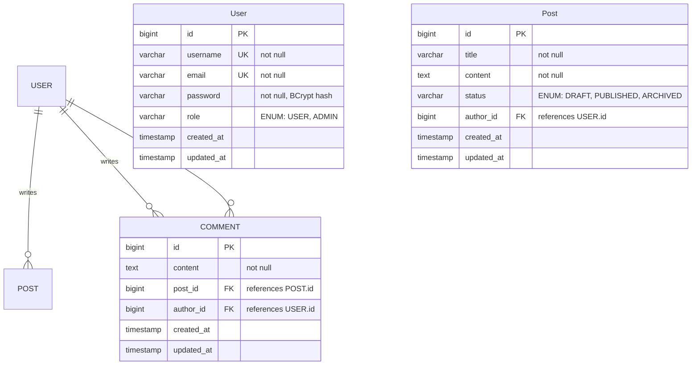

```mermaid
erDiagram
   USER ||--o{ POST : writes
   USER ||--o{ COMMENT : writes
   USER ||--o{ COMMENT : has
   User {
        bigint id PK
        varchar username UK "not null"
        varchar email UK "not null"
        varchar password "not null,   BCrypt hash"
        varchar role "ENUM: USER, ADMIN"
        timestamp created_at
        timestamp updated_at
}

    Post {
        bigint id PK
        varchar title "not null"
        text content "not null"
        varchar status "ENUM: DRAFT, PUBLISHED, ARCHIVED"
        bigint author_id FK "references USER.id"
        timestamp created_at
        timestamp updated_at
}

    COMMENT {
          bigint id PK
          text content "not null"
          bigint post_id FK "references POST.id"
          bigint author_id FK "references USER.id"
          timestamp created_at
          timestamp updated_at
}
```
